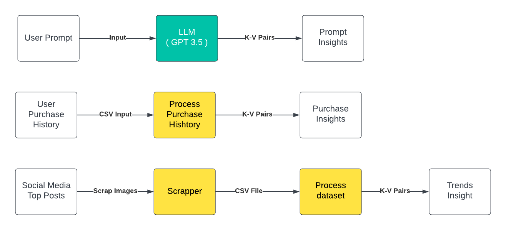
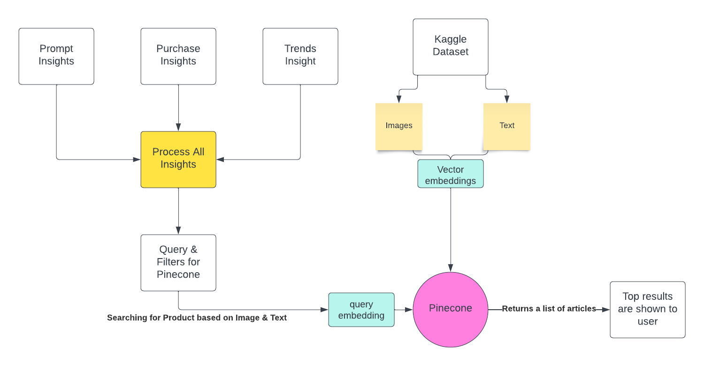

## Conversational Fashion Search System 

A conversation search on fashion products and personalized results.
Example:

Screenshots:
Prompt ->Outfit
./AssetsREADME/image-1.png
Suggesting changes
./AssetsREADME/image-2.png
./AssetsREADME/image-3.png

How it works?
-Inititally insert the image/text clip embeddings of products in the Pinecone database.

-Gathering insights from prompts,user history using key value pairs generated by gpt-4o-mini.

-Use the key value pairs to filter and search most similar product in the pinecone database.

##Tech Stack
-Langchain Openai for prompt,history processing.
-Clip model for embeddings,Pinecone for vector database.
-Backend:FastAPI
-Frontend: React.
